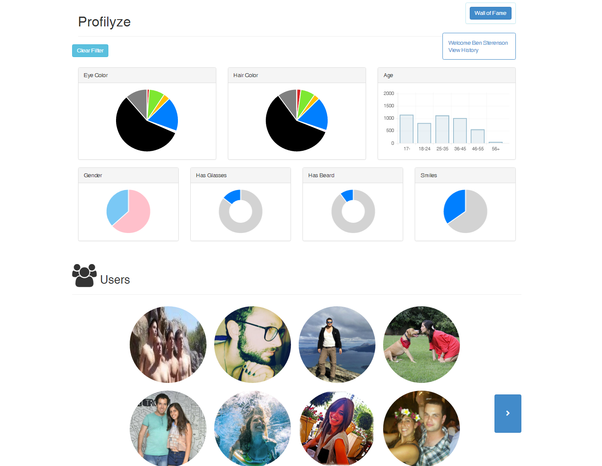

#Profilyze
######by [Ben Sterenson](https://linkedin.com/in/ben-sterenson-9430a5aa), [Lior Shkiller](https://linkedin.com/in/liorshkiller), [Royee Guy](https://il.linkedin.com/in/royee-guy-673815b8) and [Michael Palarya](https://linkedin.com/in/palarya)

---------------------------------

###Quick Overview
Profilyze was initiated as part of a [University](https://english.tau.ac.il/) project in [Database Systems](http://courses.cs.tau.ac.il/databases/databases201516/index.php) course. 
It analyzes Facebook profile pictures using [face recognition](http://www.betaface.com/) API, and stores the data on a MySQL server. 
The app allows ranking, commenting and filtering search results based on visual attributes (age, gender, eye color, etc). 

###The UI
Based on a web application presenting users a search feature alongside dynamic graphs and charts to demonstrate statistical distribution of current database’s population.

Solution Stack: 
- Backend: PHP and MySQL
- Frontend: Angularjs

- - - -

- 

- - - -

###APIs
* Facebook’s [Graph](https://developers.facebook.com/docs/graph-api) API:
	* Used for retrieving profile picture's information
	* Method examples:
graph.facebook.com/{uid}/picture?type=large

* [Betaface](http://betafaceapi.com/wpa/index.php/documentation)’s API:
	* Face recognition and analysis API providing visual characteristics
	* Method examples:
      1. UploadNewImage_Url
      2. GetImageInfo
      3. GetFaceInfo

* [Tinyurl](http://tinyurl.com/)’s API:
	* Handling Betaface API’s limitation of working with long links by creating an alternative
	* Method examples:
tinyurl.com/api-create.php?url={url}

###Database layout
To support individual users having several profile pictures, and profile pictures having both algorithm-based concluded results and application users’ ranking feeding the database, the database layout agreed is -

* Primary keys are as follows -
	* *User* : `FacebookId`
	* *Photos* : `Id`
	* *PhotoAttributes* : `Id`

* Users table is connected to photos in One To Many relationship
	* Each user can have many photos
	* `CONSTRAINT Users_To_Photos FOREIGN KEY Users_To_Photos (FacebookId) REFERENCES Users (FacebookId);`

* Photos table is connected to attributes in One To Many relationship 
	* Each photo can be rated by multiple users and an algorithm
	* `CONSTRAINT Photos_To_Attributes FOREIGN KEY Photos_To_Attributes (PhotoId) REFERENCES Photos (Id);`

* PhotoAttributes table hold a UpdatedByUser boolean value to distinguish between users’ input and Betaface’s analysis.

* FakePhotoId is used to save facebook photo ids that are used by more than one user (facebook creates a fake facebook profile and links all the users that have no profile picture to that user)

###The Workplan
The project was split four ways:
* Under the hood:	Database creation, Facebook data management - `Ben`
* Interface:		Wrapper communication between DB, API and FrontEnd - `Michael`
* Image Processing: 	API usage and data manipulation	- `Royee`
* Web Application:	Frontend design and connection to Backend - `Lior`

Besides main responsibility distribution, each project member took part in writing the SQL queries, connecting the pieces of code together, reviewing one another’s work and assembling this document.
